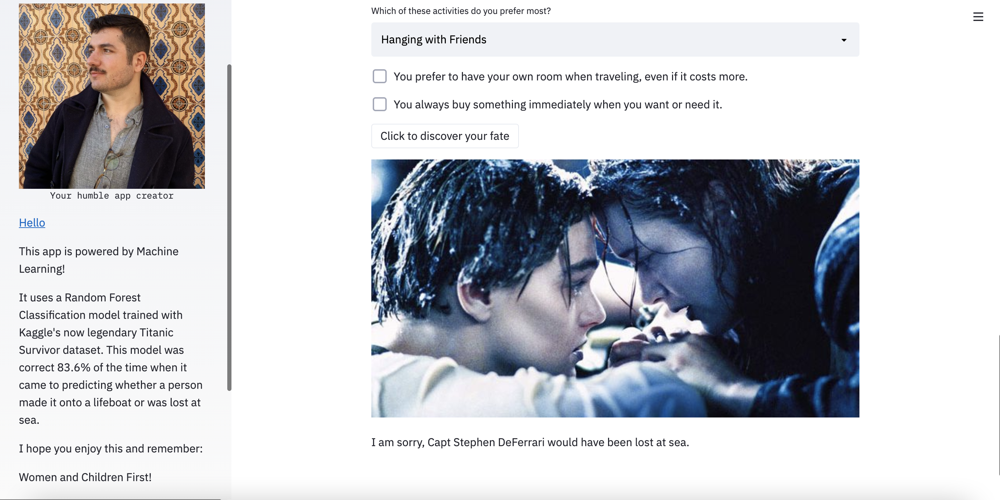

# titanic_streamlit_app
Using my code from the Kaggle Titanic classification competition, I built a streamlit app to help people figure out if they would have survived the disaster.

Find the deployed product **[here](https://share.streamlit.io/s-deferrari/titanic_streamlit_app/main/main.py)** and let me know whether you made it onto a lifeboat or not!

## Screenshots

